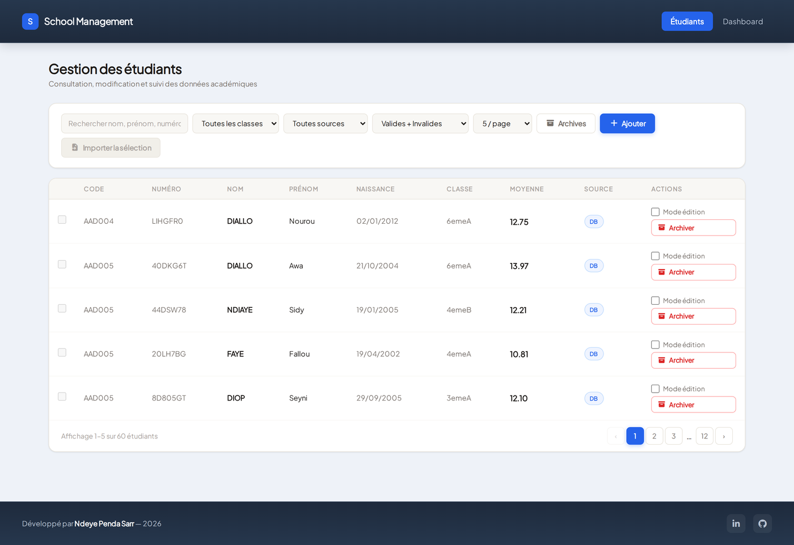
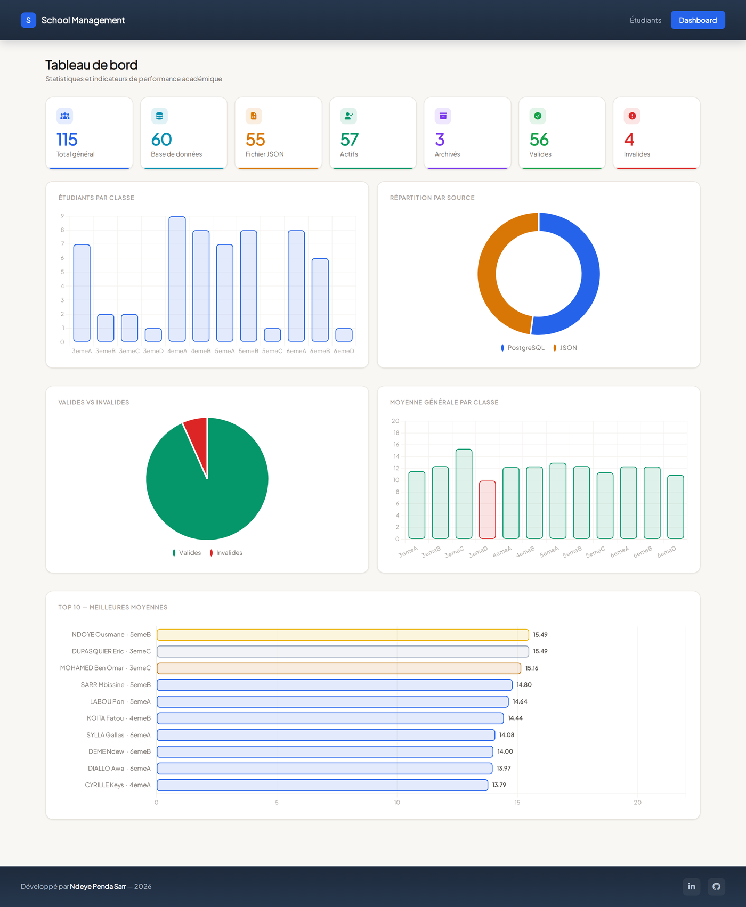
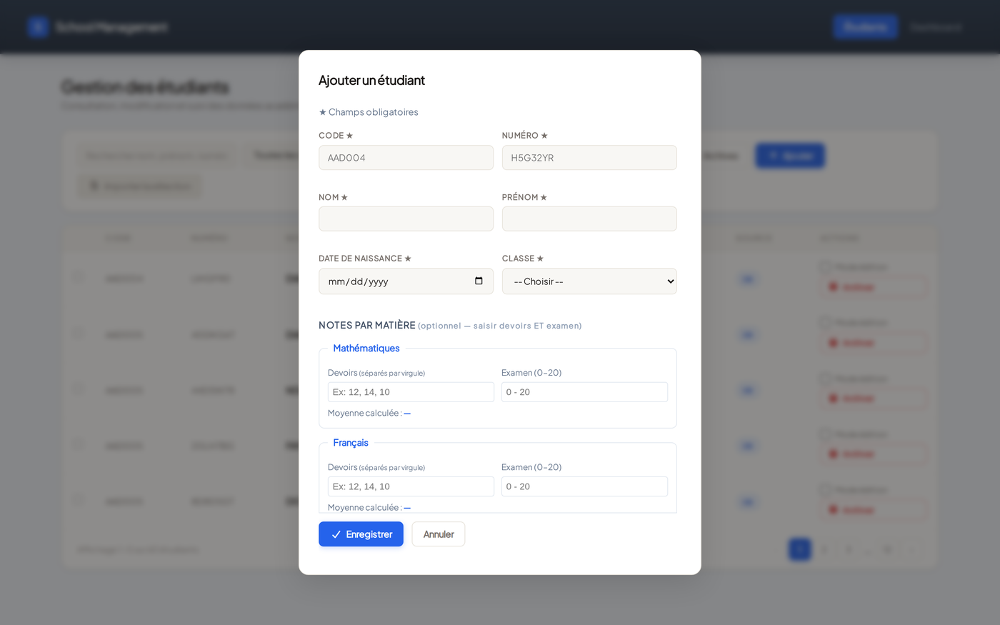
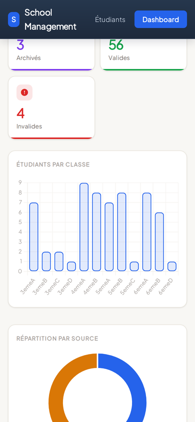

# School Management — Gestion des Étudiants


Application full-stack de gestion d'étudiants développée dans le cadre du projet intégrateur web de la formation **Développement Data** (Orange Digital Center, promotion 8).

Le cœur du projet n'est pas le CRUD : c'est la **réconciliation de deux sources de données** — une base PostgreSQL modifiable et un fichier JSON hérité en lecture seule — exposée derrière une API unique, avec traçabilité de l'origine de chaque enregistrement et import sélectif du JSON vers la base.

## Aperçu

### Gestion des étudiants


### Tableau de bord


### Création d'un étudiant avec ses notes


### Rendu mobile


## Fonctionnalités

- Liste paginée des étudiants avec recherche et filtres (classe, source, validité, archives)
- Création, modification partielle et archivage logique (soft delete) des étudiants en base
- Import sélectif d'étudiants depuis `valides.json` (115 étudiants) vers PostgreSQL
- Traçabilité de l'origine de chaque étudiant (`DB` ou `IMPORT_JSON`) — seuls les enregistrements en base sont modifiables tant qu'ils n'ont pas été importés
- Dashboard avec 5 graphiques Chart.js (répartition par classe, par source, par validité, distribution des moyennes, top 10)
- Validation stricte des données (code élève, numéro, notes bornées 0–20, normalisation nom/prénom)

## Stack technique

| Composant | Technologie |
|---|---|
| Backend | FastAPI 0.115, Uvicorn |
| Base de données | PostgreSQL, accès via `psycopg2` (SQL brut paramétré, pas d'ORM) |
| Validation | Pydantic 2.7 |
| Frontend | HTML / CSS / JavaScript vanilla, Chart.js 4 |
| Tests | Pytest (règles de validation) |
| Police / design | Plus Jakarta Sans + Instrument Serif |

## Structure du projet

```
projet_integrateur_web_fastAPI/
├── backend/
│   ├── app/
│   │   ├── main.py              # Point d'entrée FastAPI
│   │   ├── config.py            # Lecture des variables d'environnement
│   │   ├── database/
│   │   │   └── connection.py    # Connexion PostgreSQL
│   │   ├── models/
│   │   │   └── etudiant.py      # Schémas Pydantic + règles de validation
│   │   ├── routes/
│   │   │   ├── etudiants.py     # CRUD étudiants
│   │   │   ├── import_json.py   # Import depuis le JSON
│   │   │   └── stats.py         # Endpoints dashboard
│   │   └── services/            # Logique métier (requêtes SQL, fusion DB/JSON)
│   ├── data/
│   │   └── valides.json         # Étudiants hérités (115)
│   ├── sql/
│   │   └── init.sql             # Création des tables + données initiales
│   ├── tests/
│   │   └── test_validation.py   # Tests des règles Pydantic (18 cas)
│   ├── requirements.txt
│   ├── requirements-dev.txt
│   ├── .env.example             # Modèle à copier en .env
│   └── .env                     # Variables de connexion (non versionné)
├── frontend/
│   ├── index.html               # Tableau étudiants
│   ├── dashboard.html           # Dashboard statistiques
│   ├── css/style.css
│   └── js/
│       ├── app.js
│       └── dashboard.js
├── docs/
│   └── screenshots/             # Captures utilisées par ce README
├── scripts/
│   ├── setup.sh                 # Venv + dépendances + schéma SQL
│   └── run.sh                   # Démarrage du serveur
├── LICENSE
└── .gitignore
```

## Modèle de données

Cinq tables PostgreSQL avec cascades de suppression (supprimer un étudiant supprime ses résultats et devoirs) :

- **classe** — `id_classe`, `libelle_classe` (ex. `6emeA`)
- **matiere** — `id_matiere`, `libelle_matiere` (`Math`, `Francais`, `Anglais`, `PC`, `SVT`, `HG` — clés de jointure avec le JSON, affichées en toutes lettres côté interface)
- **etudiant** — `id_etudiant`, `code`, `numero`, `nom`, `prenom`, `date_naissance`, `est_archive`, `est_valide`, `source`, `id_classe`
- **resultat_matiere** — note d'examen et moyenne par étudiant/matière (contrainte d'unicité sur le couple)
- **devoir** — notes de devoirs rattachées à un `resultat_matiere`

Le script `backend/sql/init.sql` crée les tables et insère les 6 matières et 16 classes (6ème à 3ème, sections A à D) de base.

## Installation

### Prérequis
- Python 3.12
- PostgreSQL (instance locale ou distante)

### 1. Cloner le dépôt

```bash
git clone https://github.com/NdeyePendaSarr/school-management.git
cd school-management
```

### 2. Installation automatique (recommandé)

```bash
./scripts/setup.sh    # venv + dépendances + schéma PostgreSQL
./scripts/run.sh      # démarre le serveur sur http://localhost:8000
```

Le détail des étapes manuelles est décrit ci-dessous.

### 2 bis. Créer l'environnement virtuel et installer les dépendances

```bash
cd backend
python3 -m venv venv
source venv/bin/activate      # Windows : venv\Scripts\activate
pip install -r requirements.txt
```

### 3. Configurer la base de données

Copier le modèle fourni puis renseigner ses propres identifiants — le fichier `.env` n'est jamais versionné (voir `.gitignore`) :

```bash
cp backend/.env.example backend/.env
```

```env
DB_HOST=localhost
DB_PORT=5432
DB_NAME=integrateur_web_db
DB_USER=votre_utilisateur
DB_PASSWORD=votre_mot_de_passe
CORS_ORIGINS=http://localhost:8000,http://127.0.0.1:8000
```

Puis initialiser le schéma :

```bash
psql -U votre_utilisateur -d integrateur_web_db -f sql/init.sql
```

### 4. Lancer le serveur

```bash
uvicorn app.main:app --reload
```

L'application est servie sur `http://localhost:8000` :
- `/` — tableau des étudiants
- `/dashboard` — statistiques
- `/api/v1/health` — vérifie que le serveur et la base répondent

## Tests

Les règles de validation sont couvertes par 18 tests qui ne nécessitent aucune base de données :

```bash
cd backend
pip install -r requirements-dev.txt
pytest
```

## Endpoints API

Base : `/api/v1`

| Méthode | Route | Rôle |
|---|---|---|
| GET | `/etudiants` | Liste paginée, recherche, filtres classe/validité/archive |
| GET | `/etudiants/{id}` | Détail complet d'un étudiant |
| POST | `/etudiants` | Création manuelle (validation stricte) |
| PUT | `/etudiants/{id}` | Modification partielle |
| POST | `/etudiants/{id}/archive` | Archivage logique |
| POST | `/etudiants/{id}/restore` | Restauration depuis les archives |
| GET | `/json/etudiants` | Étudiants du JSON pas encore importés en base |
| POST | `/import/json` | Importe une sélection du JSON vers PostgreSQL |
| GET | `/stats/globales` | KPI globaux du dashboard |
| GET | `/stats/classes` | Statistiques par classe |
| GET | `/stats/top-moyennes` | Top 10 des meilleures moyennes |

## Règles de validation

- **Code élève** : 3 lettres majuscules + 3 chiffres (ex. `AAD004`)
- **Numéro** : 7 caractères alphanumériques, normalisé en majuscules (ex. `H5G32YR`)
- **Notes** : bornées entre 0 et 20
- **Nom / prénom** : normalisés automatiquement (nom en majuscules, prénom en title-case)

## Choix techniques et limites connues

- **SQL brut plutôt qu'un ORM** : choix assumé pour garder la maîtrise des requêtes (jointures, agrégats, `GROUP BY`) et rester explicite sur ce qui est exécuté.
- **Injection SQL** : la clause `WHERE` est construite dynamiquement, mais seule sa *structure* est interpolée ; toutes les valeurs passent en paramètres (`%s`) à psycopg2. Le filtrage est factorisé dans `_construire_filtres()` afin que le comptage et la liste appliquent toujours des critères identiques — sinon la pagination mentirait.
- **CORS** : la liste blanche est pilotée par la variable `CORS_ORIGINS`, restreinte par défaut à l'hôte local. Le frontend étant servi par FastAPI lui-même, aucune origine tierce n'est nécessaire en développement.
- **Connexions** : une connexion PostgreSQL est ouverte puis fermée à chaque requête. Suffisant à cette échelle ; un pool (`psycopg_pool`) serait la prochaine étape sous charge réelle.
- **Moyennes** : la moyenne par matière est calculée côté client à la saisie, puis validée côté serveur (bornes 0–20). Le calcul de référence reste l'agrégat SQL utilisé par le dashboard.

## Licence

MIT — voir [LICENSE](LICENSE).