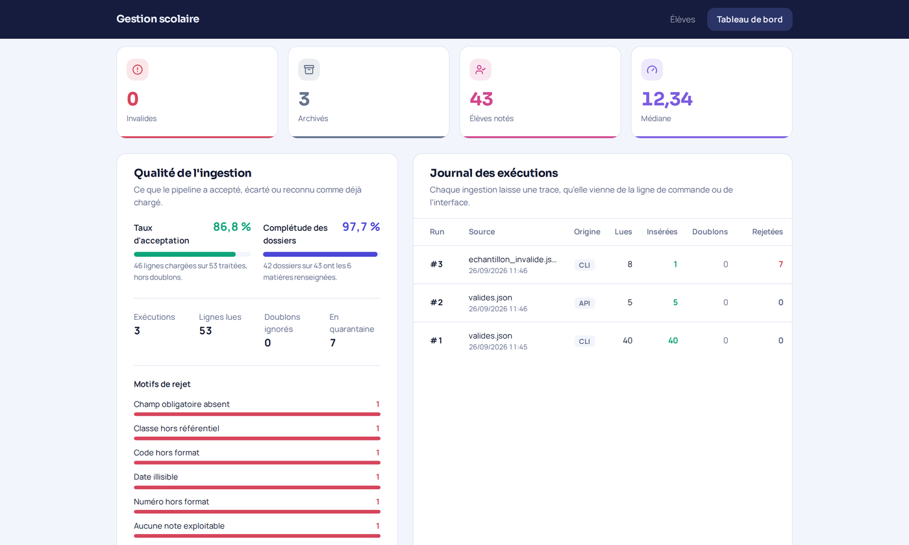
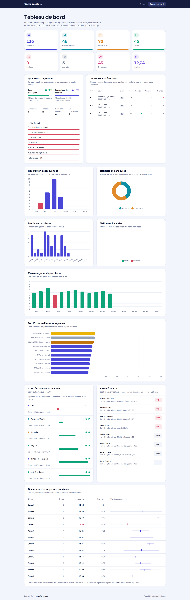
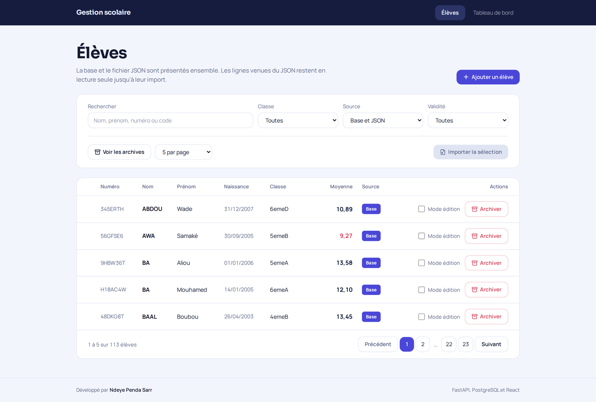
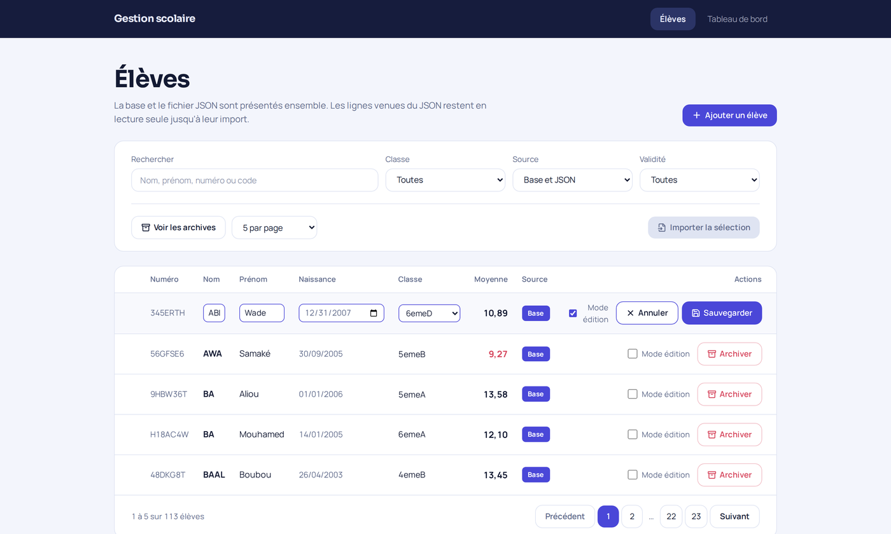
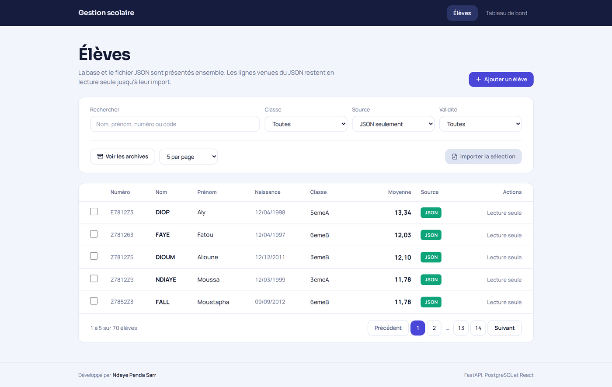
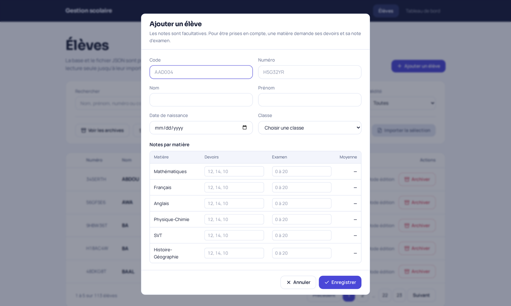
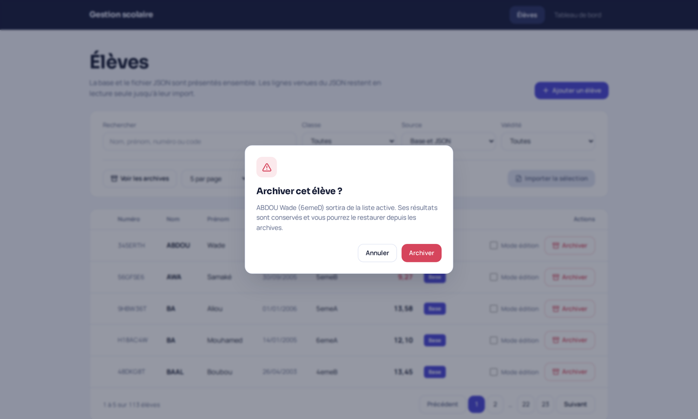
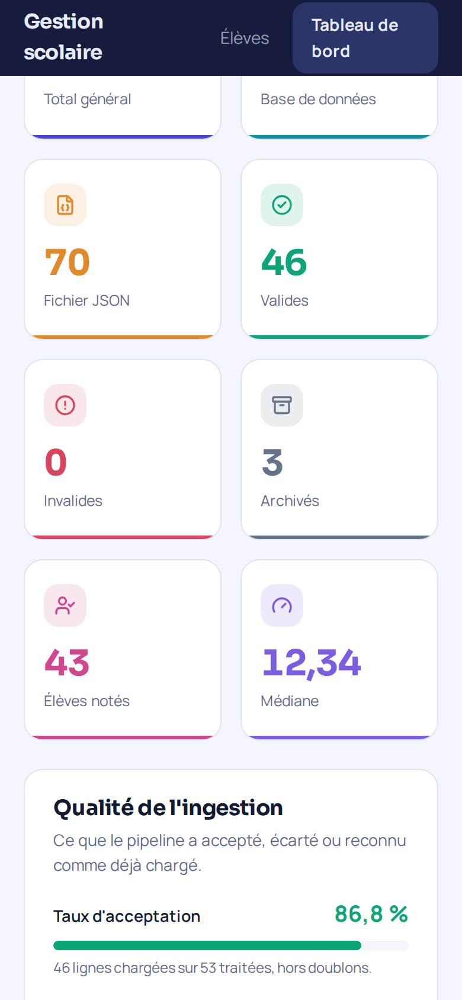

# School Management — intégration et réconciliation de données multi-sources


Application de gestion d'étudiants bâtie autour d'un **pipeline d'ingestion** : un fichier JSON hérité est validé ligne à ligne, chargé dans PostgreSQL, et réconcilié à la lecture avec les données déjà en base.

Projet individuel réalisé à l'Orange Digital Center (formation Développement Data, promotion 8), dans la continuité d'un premier projet Python qui produisait le fichier source à partir de données brutes.

## Le problème

Deux sources décrivent les mêmes étudiants et ne peuvent pas être fusionnées naïvement.

- **PostgreSQL** est la source de vérité : modifiable, archivable, historisée.
- **`valides.json`** est un fichier hérité, en lecture seule, qui contient des étudiants pas encore chargés.

Il faut donc les présenter comme une liste unique sans doublon ni trou, savoir d'où vient chaque ligne, et permettre de faire passer une ligne du fichier vers la base sans jamais l'insérer deux fois.

## Le pipeline d'ingestion

```
valides.json ──► validation ──► déduplication ──► chargement ──► PostgreSQL
                     │               │                               │
                     ▼               ▼                               ▼
                  rejet          doublon                       import_run
              (quarantaine)     (compté,                    (journal, lignage)
                                 ignoré)
```

Chaque ligne suit **un seul** des trois chemins : chargée, comptée comme doublon, ou mise en quarantaine avec son motif. La somme des trois vaut toujours le nombre de lignes lues — c'est le contrôle affiché en fin d'exécution.

**Idempotence.** `numero` est la clé métier. Une ligne déjà présente est comptée comme doublon puis ignorée. Relancer l'ingestion sur le même fichier n'insère rien et ne crée aucun duplicata.

```bash
$ python -m app.pipeline
  Lignes lues           115
  Insérées              115
  Doublons ignorés        0
  Rejetées                0

$ python -m app.pipeline        # deuxième passage
  Lignes lues           115
  Insérées                0
  Doublons ignorés      115
  Rejetées                0
```

**Quarantaine.** Une ligne non conforme n'est pas perdue en silence : elle est écrite dans la table `rejet` avec son motif, le détail de l'anomalie et sa charge utile d'origine en JSONB, pour être corrigée puis réinjectée.

| Motif | Règle violée |
|---|---|
| `CHAMP_MANQUANT` | Un champ obligatoire est absent |
| `FORMAT_CODE` | Trois lettres majuscules puis trois chiffres |
| `FORMAT_NUMERO` | Sept caractères alphanumériques |
| `FORMAT_NOM` | Nom de deux lettres minimum, prénom de trois, commençant par une lettre |
| `FORMAT_DATE` | Date illisible dans les formats acceptés |
| `CLASSE_INCONNUE` | Classe absente du référentiel |
| `NOTE_HORS_BORNES` | Note en dehors de l'intervalle 0–20 |
| `NOTES_ABSENTES` | Aucune matière avec devoirs et examen |

**Traçabilité.** Chaque exécution ouvre une ligne dans `import_run` (source, déclencheur, statut, volumes, durée) et chaque étudiant chargé garde l'identifiant du run qui l'a inséré. On sait donc, pour n'importe quelle ligne en base, quand et par quelle exécution elle est arrivée.

**Un seul chemin de code.** L'import déclenché depuis l'interface et l'ingestion en ligne de commande passent par la même fonction : mêmes règles, même quarantaine, même journal. Deux entrées, une seule logique — sinon les deux divergent.

## Réconciliation à la lecture

`GET /etudiants` reçoit le numéro de page, applique les filtres, interroge PostgreSQL, complète avec le JSON si la base ne fournit pas assez de lignes, et ne retourne que les lignes de la page demandée. La fusion est faite **côté serveur** ; le frontend fait un seul appel.

PostgreSQL étant la source principale, la liste globale est la base d'abord puis le JSON, qui reprend exactement là où la base s'arrête : ni doublon ni trou à la frontière. Chaque ligne porte son origine, `DB` ou `JSON`, et les lignes JSON restent en lecture seule jusqu'à leur import.

## Observabilité

| Endpoint | Ce qu'il expose |
|---|---|
| `GET /api/v1/qualite/indicateurs` | Taux d'acceptation, complétude des dossiers, volumes cumulés |
| `GET /api/v1/qualite/runs` | Journal des dernières exécutions |
| `GET /api/v1/qualite/rejets` | Lignes en quarantaine, regroupées par motif |

Le taux d'acceptation rapporte les lignes chargées aux lignes réellement traitées : les doublons, qui ne sont ni une réussite ni un échec, en sont exclus. La complétude mesure la part des dossiers dont les six matières du référentiel sont renseignées.

## Aperçu

### Qualité de l'ingestion et journal des exécutions


### Tableau de bord


### Liste réconciliée : chaque ligne porte son origine


### Mode édition : les quatre champs s'ouvrent ensemble


### Les lignes venues du JSON restent en lecture seule


### Création d'un élève avec ses notes


### Confirmation avant archivage


### Rendu mobile


## Stack

| Couche | Technologies |
|---|---|
| Backend | Python 3.12, FastAPI, psycopg2, Pydantic |
| Base de données | PostgreSQL 16, SQL écrit à la main |
| Frontend | React 19, Vite, Tailwind CSS 4, Chart.js, Lucide |
| Tests | Pytest |
| Typographie | Sora et Manrope, auto-hébergées |

## Tableau de bord

Indicateurs affichés : total général, données venues de PostgreSQL, données venues du JSON, valides, invalides, archivées, élèves notés et médiane de la promotion.

Statistiques tracées avec Chart.js : répartition des données par classe, répartition par source, répartition valides / invalides, moyenne générale par classe, top 10 des meilleures moyennes, et répartition des moyennes par tranche.

S'y ajoutent trois analyses qui vont au-delà du cadre demandé : écart entre contrôle continu et examen par matière, élèves à accompagner avec leur matière la plus faible, et dispersion des moyennes par classe.

| Endpoint | Question à laquelle il répond |
|---|---|
| `GET /api/v1/stats/globales` | Combien d'élèves, dans quel état, depuis quelle source ? |
| `GET /api/v1/stats/classes` | Combien d'élèves par classe, et quelle moyenne ? |
| `GET /api/v1/stats/top-moyennes` | Qui sont les dix meilleures moyennes ? |
| `GET /api/v1/stats/distribution` | Où se situe la promotion par rapport à la barre des 10 ? |
| `GET /api/v1/stats/matieres` | Dans quelles matières l'écart entre devoirs et examen est-il le plus fort ? |
| `GET /api/v1/stats/eleves-a-suivre` | Quels élèves accompagner, et sur quelle matière ? |
| `GET /api/v1/stats/dispersion-classes` | Quelles classes sont homogènes, lesquelles sont éclatées ? |

Le calcul est fait en SQL : agrégats, `PERCENTILE_CONT` pour la médiane, `STDDEV_POP` pour la dispersion, `DISTINCT ON` pour la matière la plus faible de chaque élève.

## Endpoints élèves

| Méthode | Route | Rôle |
|---|---|---|
| `GET` | `/api/v1/etudiants` | Page fusionnée base + JSON, filtres recherche / classe / source / archive / validité |
| `GET` | `/api/v1/etudiants/{id}` | Détail avec les notes par matière |
| `POST` | `/api/v1/etudiants` | Création, notes comprises |
| `PUT` | `/api/v1/etudiants/{id}` | Modification partielle |
| `POST` | `/api/v1/etudiants/{id}/archive` | Archivage |
| `POST` | `/api/v1/etudiants/{id}/restore` | Restauration |
| `GET` | `/api/v1/json/etudiants` | Lignes du JSON pas encore importées |
| `POST` | `/api/v1/import/json` | Import d'une sélection vers la base |
| `GET` | `/api/v1/health` | État du serveur et de la base |

La documentation interactive est sur `/docs` une fois le serveur lancé.

## Modèle de données

- **classe** — `id_classe`, `libelle_classe`
- **matiere** — `id_matiere`, `libelle_matiere` (`Math`, `Francais`, `Anglais`, `PC`, `SVT`, `HG` : clés de jointure avec le JSON, affichées en toutes lettres dans l'interface)
- **etudiant** — identité, `est_archive`, `est_valide`, `source`, rattaché à une classe
- **resultat_matiere** — note d'examen et moyenne, un enregistrement par élève et par matière
- **devoir** — notes de contrôle continu rattachées à un résultat
- **import_run** — journal d'exécution du pipeline : source, déclencheur (`CLI` ou `API`), statut, volumes lus / insérés / doublons / rejetés, horodatage
- **rejet** — quarantaine : motif, détail, charge utile d'origine en `JSONB`, rattachée au run qui l'a produite

## Règles de validation

| Champ | Règle |
|---|---|
| `code` | Trois lettres majuscules puis trois chiffres (`AAD004`) |
| `numero` | Sept caractères alphanumériques, normalisés en majuscules |
| `nom` | Deux caractères minimum, commence par une lettre, stocké en majuscules |
| `prenom` | Trois caractères minimum, commence par une lettre, première lettre capitalisée |
| Notes | Comprises entre 0 et 20, au moins un devoir par matière renseignée |

## Installation

### 1. Prérequis

Python 3.12, PostgreSQL 16 et Node.js 20 ou plus.

### 2. Cloner et installer

```bash
git clone https://github.com/NdeyePendaSarr/school-management.git
cd school-management
./scripts/setup.sh
```

Au premier passage, le script crée `backend/.env` depuis le modèle et s'arrête : renseignez vos identifiants PostgreSQL, puis relancez-le. Il installe ensuite les dépendances Python, applique le schéma SQL et construit l'interface React.

> `sql/init.sql` commence par des `DROP TABLE`. Ne relancez pas `setup.sh` sur une base contenant des données à conserver.

### 3. Charger les données

```bash
cd backend
python -m app.pipeline --limite 40            # charge 40 lignes
python -m app.pipeline                        # charge tout le fichier
python -m app.pipeline --fichier autre.json   # ou un autre fichier
```

`--limite` ne charge qu'une partie du fichier. C'est la façon normale d'alimenter l'application : le reste demeure dans le JSON, qui garde son rôle de source secondaire — il complète l'affichage tant que la base ne suffit pas, et c'est de là que partent les imports sélectifs. Charger tout le fichier d'un coup vide la source secondaire, et plus aucune ligne `JSON` n'apparaît.

L'opération est idempotente : relancez-la sans crainte.

Un échantillon volontairement non conforme accompagne le dépôt pour rendre la quarantaine vérifiable. Chacune de ses lignes viole une règle, et une seule :

```bash
python -m app.pipeline --fichier data/echantillon_invalide.json
```

Sept lignes sur huit partent en quarantaine, une par motif, et la huitième est chargée. Les rejets sont ensuite consultables dans le tableau de bord ou via `GET /api/v1/qualite/rejets`.

### État reproduit par les captures

Les copies d'écran de ce README proviennent d'un clone neuf, dans l'état produit par ces trois commandes :

```bash
python -m app.pipeline --limite 40                              # 40 lignes chargées
# puis, depuis l'interface : sélection de 5 lignes JSON et import
python -m app.pipeline --fichier data/echantillon_invalide.json # 7 rejets
```

Soit 46 élèves en base, 70 restés dans le JSON, 3 archivés, 7 lignes en quarantaine et 3 exécutions au journal.

### 4. Démarrer

```bash
./scripts/run.sh
```

L'application est sur `http://localhost:8000`.

### Installation manuelle

```bash
# Backend
cd backend
python3 -m venv venv && source venv/bin/activate
pip install -r requirements.txt
cp .env.example .env          # puis renseigner ses identifiants
psql -U votre_utilisateur -d integrateur_web_db -f sql/init.sql

# Frontend
cd ../frontend-react
npm install && npm run build

# Serveur
cd ../backend && uvicorn app.main:app --reload
```

## Développer l'interface

En développement, React tourne sur son propre serveur avec rechargement à chaud, et les appels `/api` sont relayés vers FastAPI :

```bash
# Terminal 1
cd backend && uvicorn app.main:app --reload

# Terminal 2
cd frontend-react && npm run dev     # http://localhost:5173
```

Avant de déployer ou de committer une modification visible, reconstruire avec `npm run build` : c'est `frontend-react/dist` que FastAPI sert.

## Tests

41 tests couvrent les règles de validation Pydantic et celles du pipeline d'ingestion, motif de rejet par motif de rejet. Aucun ne demande de base de données :

```bash
cd backend
pip install -r requirements-dev.txt
pytest
```

## Structure

```
school-management/
├── backend/
│   ├── app/
│   │   ├── main.py               # Application FastAPI, sert aussi le frontend
│   │   ├── config.py             # Variables d'environnement
│   │   ├── database/             # Connexion PostgreSQL
│   │   ├── models/               # Schémas et validation Pydantic
│   │   ├── pipeline/             # Ingestion : validation, quarantaine, journal
│   │   ├── routes/               # Endpoints HTTP
│   │   └── services/             # Requêtes SQL et logique métier
│   ├── sql/init.sql              # Schéma et données de référence
│   ├── data/valides.json         # Source JSON héritée
│   ├── tests/                    # Tests des règles de validation
│   └── .env.example              # Modèle à copier en .env
├── frontend-react/
│   └── src/
│       ├── api.js                # Accès API et formatage
│       ├── pages/                # Élèves, Tableau de bord
│       └── composants/           # Graphiques et briques d'interface
├── frontend/                     # Première version, HTML et JS sans framework
├── docs/screenshots/
└── scripts/                      # setup.sh, run.sh
```

Le dossier `frontend/` est la version initiale du projet, en HTML, CSS et JavaScript sans framework. Elle n'est plus servie mais reste dans le dépôt : elle montre d'où part l'interface actuelle.

## Choix techniques et limites connues

- **SQL brut plutôt qu'un ORM.** Choix assumé pour garder la maîtrise des jointures, des agrégats et des fonctions de fenêtrage, et rester explicite sur ce qui est exécuté.
- **Injection SQL.** La clause `WHERE` est construite dynamiquement, mais seule sa *structure* est interpolée ; toutes les valeurs passent en paramètres (`%s`) à psycopg2. Le filtrage est factorisé dans `_construire_filtres()` afin que le comptage et la liste appliquent toujours des critères identiques — sinon la pagination mentirait.
- **Fusion des deux sources côté serveur.** `GET /etudiants` reçoit le numéro de page, applique les filtres, interroge PostgreSQL, complète avec le JSON si la base ne fournit pas assez de lignes, puis ne retourne que les lignes de la page. Le frontend n'a rien à recoller. PostgreSQL étant la source principale, la liste globale est la base d'abord puis le JSON, qui reprend exactement là où la base s'arrête : ni doublon ni trou à la frontière.
- **Édition.** Deux voies, comme le veut l'énoncé : double-clic sur une cellule avec validation par Entrée et annulation par Échap, ou case « Mode édition » qui ouvre les quatre champs d'un coup. Les lignes venues du JSON restent en lecture seule.
- **Direction visuelle.** Indigo et menthe : bandeau nuit `#161C3D`, fond `#F3F5FC`, indigo `#4A47D8` pour les actions et les barres, menthe `#0EA47A` pour les écarts positifs. Le rouge `#D6455C` ne sert qu'à signaler une moyenne sous la barre des 10 — jamais de décoration. L'en-tête et les boutons utilisent deux jetons distincts : les confondre aplatit la hiérarchie.
- **Graphiques sans bibliothèque de charts.** Histogramme, barres divergentes, étendues et anneau de répartition sont dessinés en CSS et en SVG. La contrainte qui a tranché : la barre des 10 doit tomber sur la frontière entre deux tranches, là où un axe catégoriel la place au centre de l'une d'elles. Le poids du bundle y gagne. La contrainte qui a tranché : la barre des 10 doit tomber exactement sur la frontière entre deux tranches, là où un axe catégoriel la place au centre de l'une d'elles. Le poids du bundle y gagne au passage.
- **CORS.** Liste blanche pilotée par `CORS_ORIGINS`, restreinte par défaut à l'hôte local. Le frontend étant servi par FastAPI, aucune origine tierce n'est nécessaire.
- **Connexions.** Une connexion PostgreSQL est ouverte puis fermée à chaque requête. Suffisant à cette échelle ; un pool (`psycopg_pool`) serait la prochaine étape sous charge réelle.
- **Moyennes des lignes JSON.** Elles sont dérivées des notes du fichier, côté navigateur, et affichées à titre indicatif. Le calcul de référence reste l'agrégat SQL, qui ne porte que sur les élèves présents en base.

## Licence

MIT — voir [LICENSE](LICENSE).
